# 知识助手技术方案 - 企业智能知识管理的多Agent协作引擎

> **版本**: v1.0  
> **主题**: 基于多Agent协作的企业知识助手系统 - 实现智能化文档写作、精准搜索、规则审阅与问答服务的一体化解决方案  
> **描述**: 本方案通过构建分层架构的多Agent协作体系，将复杂的企业知识管理任务拆解为专业化、可编排的子任务流，实现从用户意图识别到最终结果交付的全流程自动化与智能化。

---

## 目录

1. [系统架构概览](#一系统架构概览) - 整体技术架构与请求处理流水线
2. [核心协作模式](#二核心协作模式) - Agent间的协作机制与设计原则
3. [场景一：写作Agent工作流](#三场景一写作agent工作流) - 智能文档生成与大纲编排
4. [场景二：文件搜索Agent](#四场景二文件搜索agent) - 多维度精准文档检索
5. [场景三：规则审阅Agent](#五场景三规则审阅agent) - 智能合规风险检测
6. [场景四：文档问答Agent](#六场景四文档问答agent) - 基于知识库的智能问答

---

## 一、系统架构概览

> **本章导言**: 系统采用分层解耦的架构设计理念，将用户交互、智能决策、任务执行与数据基础设施清晰分离，通过标准化的接口协议实现层间协作，确保系统的可扩展性与可维护性。

### 1.1 整体架构图

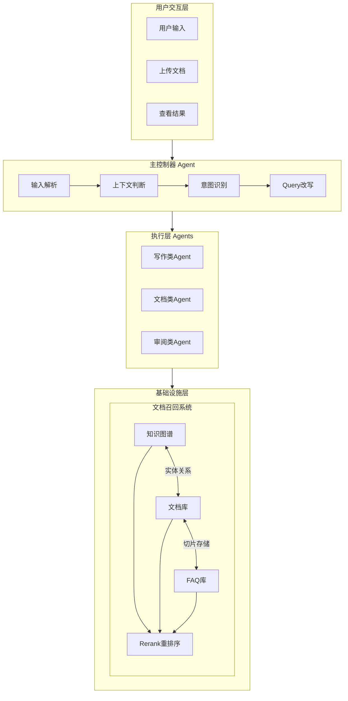

**架构分层说明**:

- **用户交互层**: 统一接入用户请求，支持多模态输入（文本、文档）
- **主控制器**: 核心调度中枢，负责任务解析、意图识别与路由分发
- **执行层**: 专业化Agent集群，针对特定场景提供深度处理能力
- **基础设施层**: 企业知识底座，整合多源异构数据的统一召回能力

### 1.2 请求处理流水线

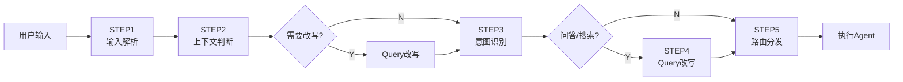

**流水线设计要点**:

1. **输入解析**: 提取用户Query与上传内容，建立初始上下文
2. **上下文判断**: 识别多轮对话场景，确定是否需要上下文关联改写
3. **意图识别**: 精准分类用户意图（写作/问答/搜索/审阅）
4. **Query改写**: 针对检索类意图，扩展搜索词以提升召回效果
5. **路由分发**: 基于意图+Skill路由至目标Agent执行

---

## 二、核心协作模式

> **本章导言**: Agent间的协作模式决定了系统的灵活性与响应效率。本章节阐述支撑整个系统的协作设计原则，确保多Agent协同工作的有序性与可靠性。

### 2.1 设计原则

1. **单一职责原则**: 每个Agent只做一件事，职责边界清晰
2. **分层架构**: 接入层 → 预处理层 → 决策层 → 执行层 → 数据层
3. **条件触发**: 不是所有Agent都执行，根据条件选择性调用
4. **结果传递**: 通过标准化变量传递结果，形成处理流水线
5. **错误处理**: 每个Agent都有前置校验与降级策略

---

## 三、场景一：写作Agent工作流

> **本章导言**: 写作Agent是知识助手的核心生产力工具，通过"大纲规划-内容填充-全文生成"的分层写作模式，实现从创意构想到成稿交付的完整写作闭环，满足不同场景下的文档创作需求。

### 3.1 核心能力亮点

**智能写作引擎**为企业文档创作带来革命性效率提升：

- **模板化写作**: 支持系统预设模板与用户自定义模板双轨并行，技术报告、商业计划书、会议纪要等常见文档类型一键套用专业结构
- **知识增强创作**: 自动召回企业知识库中的相关参考资料，确保写作内容与企业知识体系保持一致，避免信息孤岛
- **人机协作模式**: 全文写作先生成大纲待用户确认后再填充正文，兼顾AI效率与人类把控，重要文档产出更安心
- **结构严格遵循**: 大纲写作模式确保输出严格遵循用户提供的结构，不擅自增删章节，满足合规性文档的格式要求
- **一键成稿能力**: 帮我写作模式只需一句话描述需求，系统自动完成大纲规划、内容填充、格式排版全流程，分钟级输出完整可用文档

### 3.2 写作Agent架构

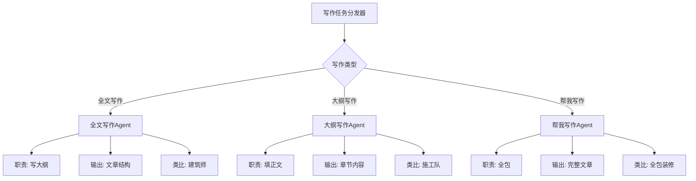

### 3.3 全文写作Agent流程

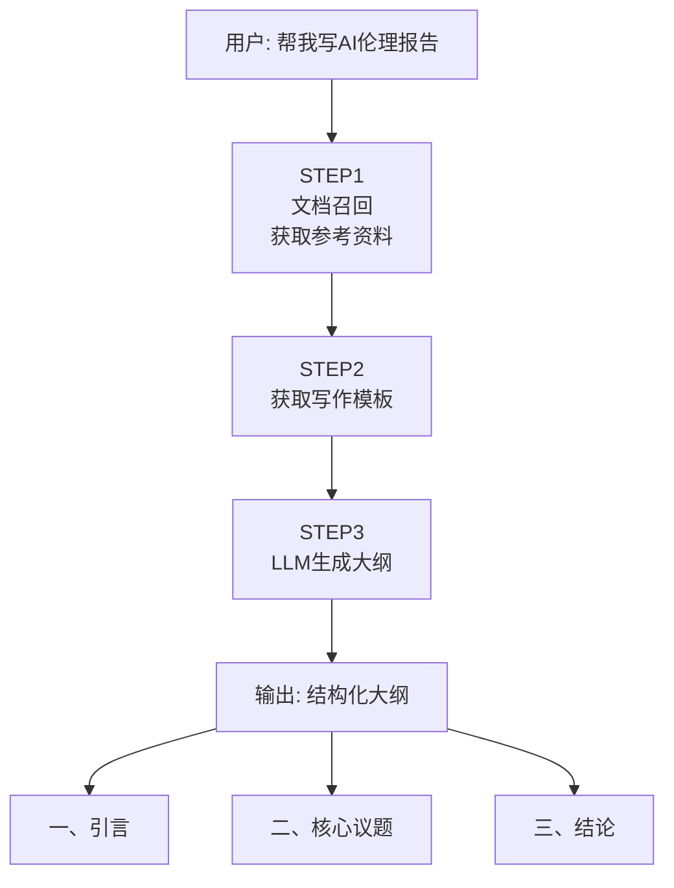

**全文写作特点**: 先生成大纲框架，用户确认后再进行正文写作，适合需要人机协作确认结构的场景。

### 3.4 大纲写作Agent流程

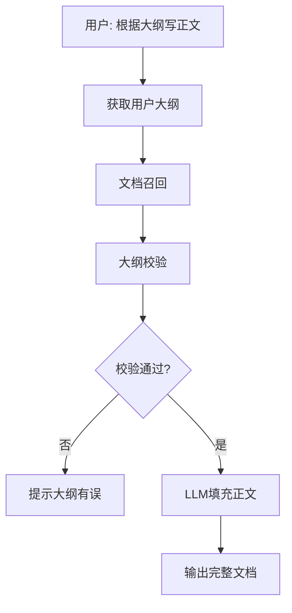

**大纲写作特点**: 严格遵循用户提供的结构进行内容填充，确保输出与用户预期一致。

### 3.5 帮我写作Agent流程

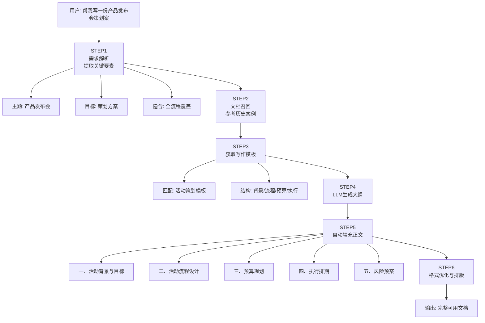

**帮我写作特点**: 

- **全自动流程**: 用户只需一句话描述需求，系统自动完成从需求解析到成稿输出的全流程
- **智能模板匹配**: 根据需求自动识别文档类型并匹配最佳模板结构（策划案/报告/邮件等）
- **知识库增强**: 自动召回企业历史类似文档作为参考，确保内容符合企业风格与标准
- **即拿即用**: 输出经过格式优化的完整文档，无需二次编辑即可投入使用

**适用场景**:

- 日常办公文档快速生成（会议纪要、周报、通知公告）
- 标准化文档一键产出（合同模板、报价单、邀请函）
- 紧急场景下的快速响应（临时汇报材料、应急方案）

### 3.6 写作Agent对比

| 维度   | 全文写作    | 大纲写作    | 帮我写作 |
| ---- | ------- | ------- | ---- |
| 输入   | 主题/需求   | 大纲      | 需求描述 |
| 输出   | 大纲(无正文) | 正文(按大纲) | 完整文章 |
| 适用场景 | 需先确认结构  | 结构已确定   | 快速出稿 |
| 协作方式 | 人机协作    | 人机协作    | 全自动  |
| 灵活性  | 只规划不写作  | 严格按大纲写  | 自由发挥 |

---

## 四、场景二：文件搜索Agent

> **本章导言**: 文件搜索Agent针对企业海量文档的精准定位需求，融合知识图谱的语义理解能力与文档库的向量检索技术，实现基于人名、时间、内容等多维度的智能文件查找。

### 4.1 核心能力亮点

**智能文件定位**让海量企业文档触手可及：

- **自然语言理解**: 支持"张三去年写的销售报告"、"上周李总发的会议纪要"等自然语言描述，系统自动解析人名、时间、主题等关键要素
- **语义级搜索**: 超越传统关键词匹配，基于向量语义相似度召回相关内容，即使文档中没有出现查询词也能精准定位
- **知识图谱赋能**: 利用实体关系图谱（人员-创建-文档、项目-包含-文件）实现基于关系的智能推荐，发现隐性关联文档
- **版本智能排序**: 自动识别文档版本号（v1/v2、6.0/7.0），优先展示最新版本，避免用户使用过时的历史文档
- **时效感知过滤**: 自动识别"最近两年"、"本季度"等时效要求，结合文档创建/修改时间进行精准过滤

### 4.2 文件搜索流程

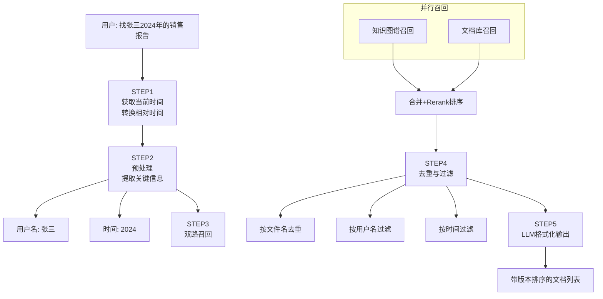

**搜索能力亮点**:

- **时间智能解析**: 自动将"昨天"、"上周"等相对时间转换为具体日期
- **多路召回融合**: 知识图谱(实体关系) + 文档库(向量相似度) 双路并行
- **精准过滤排序**: 支持用户名、时间范围、版本号的多维过滤与智能排序

---

## 五、场景三：规则审阅Agent

> **本章导言**: 规则审阅Agent为企业合同、制度文档的合规性检查提供智能化解决方案。通过三重降级策略确保文档内容的可靠获取，结合领域专家模板实现风险点的精准识别与标注。

### 5.1 核心能力亮点

**智能合规助手**为企业法律风控保驾护航：

- **三重降级保障**: 向量检索 → GPU解析 → CPU解析的层级降级策略，确保任何情况下都能获取文档内容，系统可用性达到99.9%
- **长文档处理能力**: 支持15000+字符的合同长文本分块审阅，逐段分析不遗漏任何条款风险
- **风险分级标注**: 输出✅无风险 / ⚠️低风险 / 🔴高风险的视觉化标识，帮助法务人员快速识别需要重点关注的条款
- **法律依据引用**: 不仅指出问题，还引用相关法律法规条文作为依据，提升审阅报告的专业性与可信度
- **多格式兼容**: 支持PDF、Word、Excel等常见商务文档格式的解析与审阅，无需用户手动转换

### 5.2 规则审阅流程

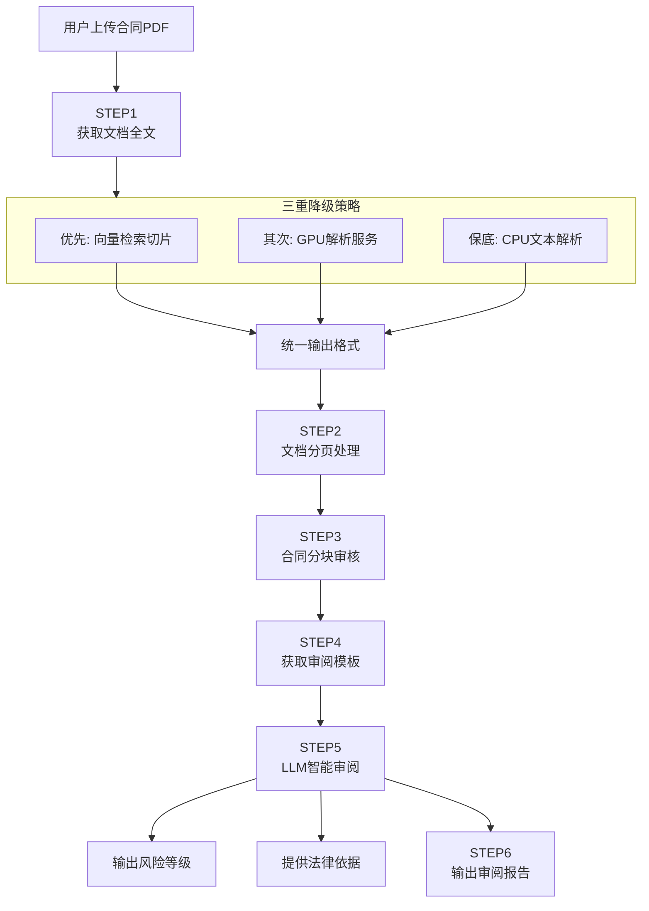

**三重降级策略说明**:

| 获取方式      | 触发条件    | 响应速度       | 切片质量    | 适用场景      |
| --------- | ------- | ---------- | ------- | --------- |
| **向量检索**  | query存在 | 快（毫秒级）     | 高（语义相关） | 用户有明确审阅方向 |
| **GPU解析** | 向量检索失败  | 中（秒级~200秒） | 高（结构完整） | 需要完整文档内容  |
| **CPU解析** | GPU解析失败 | 较快（秒级）     | 中（基础文本） | 服务降级保底    |

**审阅输出结构**:

- **总体评价**: 文档整体合规性概述
- **详细审查意见**: 逐条风险点标注（✅无风险 / ⚠️低风险 / 🔴高风险）
- **修改建议汇总**: 可操作的改进建议表格

---

## 六、场景四：文档问答Agent

> **本章导言**: 文档问答Agent是知识助手的高频使用场景，通过深度融合企业知识库与大型语言模型，实现基于私有文档的精准问答，支持版本控制、冲突检测与智能追问，打造企业专属的AI知识顾问。

### 6.1 核心能力亮点

**企业专属知识顾问**让知识获取前所未有的高效：

- **私有知识库问答**: 基于企业自有文档进行问答，确保答案来源于企业内部资料，避免通用AI的"幻觉"问题
- **版本智能管理**: 自动识别用户问题中的版本信息（如"AnyShare 7如何升级"），优先召回对应版本文档，并在多版本冲突时自动标注差异
- **答案可溯源**: 每个回答都附带参考文档来源，用户可一键跳转到原文出处，确保信息可信度
- **智能追问推荐**: 基于召回文档自动生成3个递进式相关问题，引导用户深入了解主题，挖掘更多知识价值
- **多源融合回答**: 支持同时检索知识图谱、文档库、FAQ库三类数据源，综合多源信息给出全面答案
- **时效性保障**: 自动过滤过期文档（如2年前的操作指南），确保用户获得的是最新有效的信息

### 6.2 文档问答流程

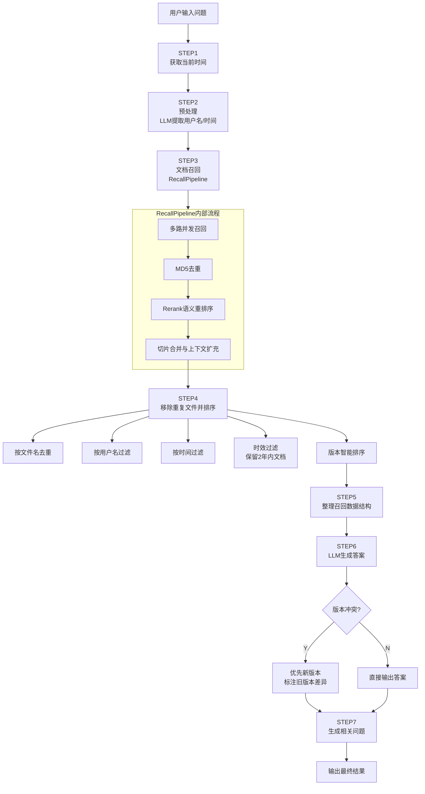

### 6.3 版本筛选与排序规则

文档问答Agent内置智能版本管理机制，自动识别和处理文档版本：

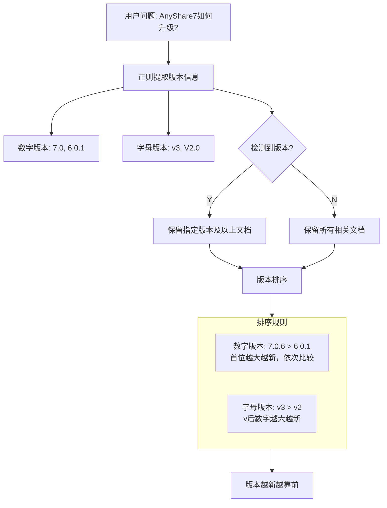

**版本识别示例**:

| 用户Query           | 识别版本 | 处理逻辑                 |
| ----------------- | ---- | -------------------- |
| "AnyShare 7如何升级?" | 7.x  | 保留7.x及以上文档，丢弃6.x/5.x |
| "v3版本功能介绍"        | v3.x | 保留v3及以上版本文档          |
| "如何升级"            | 无    | 保留所有版本，按版本号排序        |

### 6.4 冲突处理机制

当召回的多份文档存在信息不一致时，Agent自动进行冲突检测与处理：

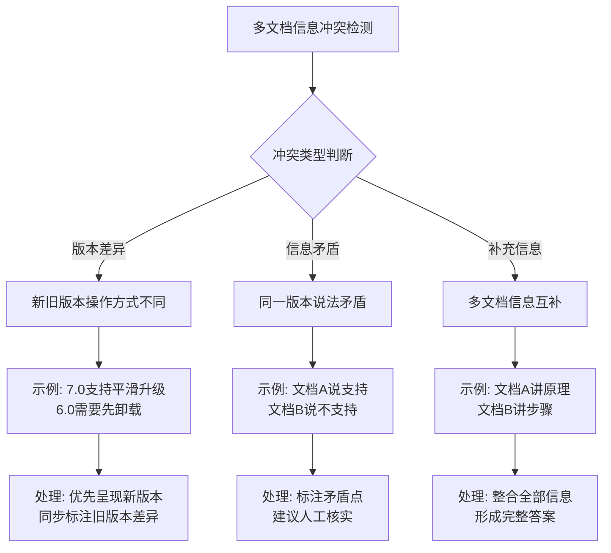

**冲突处理输出示例**:

> **主结论**: AnyShare 7.0支持平滑升级，无需卸载旧版本
>
> **版本差异标注**: 注意：[AnyShare 6.0升级指南]提及"需要先卸载旧版本"，与新版本存在差异，建议以新版本为准

### 6.5 答案质量控制机制

为确保答案质量，系统建立了多层质量保障机制：

| 控制点        | 控制措施                   | 目的            |
| ---------- | ---------------------- | ------------- |
| **召回质量控制** | Rerank语义重排序 + 分数阈值过滤   | 确保参考文档与问题高度相关 |
| **时效性控制**  | 自动过滤2年前文档              | 确保答案基于最新信息    |
| **完整性控制**  | 要求LLM逐句检查所有召回文档        | 确保信息无遗漏       |
| **准确性控制**  | System Prompt约束，禁止推测编造 | 确保答案严格基于文档    |
| **可追溯控制**  | 答案附带参考文档来源             | 确保用户可验证信息出处   |

### 6.6 输入参数说明

| 参数名              | 类型     | 必填  | 说明               |
| ---------------- | ------ | --- | ---------------- |
| `as_ctx`         | object | 是   | 上下文对象，包含用户信息、权限等 |
| `query`          | string | 是   | 用户原始问题           |
| `query_rewrite`  | string | 否   | 改写后的查询（用于文档召回）   |
| `content`        | string | 否   | 用户上传的文档内容（可选）    |
| `web_search_res` | string | 否   | 联网搜索结果（可选）       |

---

*文档生成时间: 2026-04-13*  
*更新说明: 本次修订补充了主题定位，优化了架构图为流程图形式，精简了协作模式描述，移除了代码实现细节，为各章节增加了导言与能力亮点描述。*
